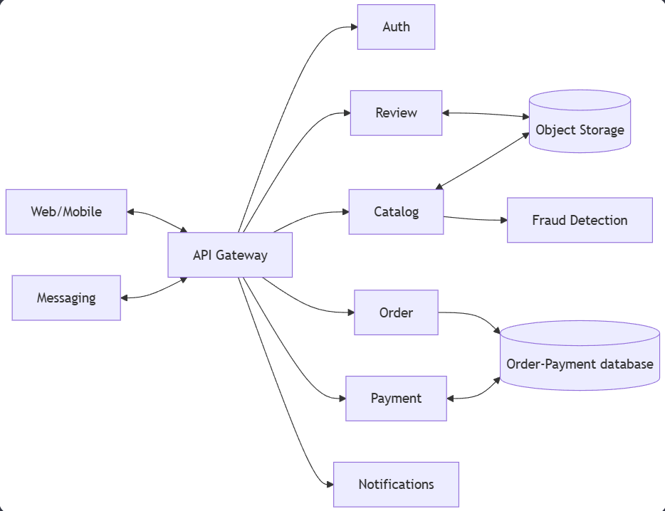

## 1\. 📖 Описание функциональных границ микросервиса

### 1\.1 Диаграмма компонентов архитектуры

{width=934px height=718px}

### 1\.2 Описание микросервиса

Микросервис **Order (заказы, корзина)**. Он отвечает за полный жизненный цикл заказа: от формирования корзины товаров до фиксации завершенной сделки. Сервис обеспечивает согласованность данных о заказах и координирует взаимодействие с другими сервисами (`Payment`, `Catalog`, `Fraud Detection`) для успешного выполнения бизнес-процесса.

**Обеспечивает следующую функциональность:**

-  **Управление корзиной покупок (cart) :**

   -  Создание и привязка корзины к сессии или авторизованному пользователю.

   -  Добавление товаров в корзину, изменение их количества и удаление.

   -  Расчет предварительной стоимости корзины с учетом актуальных цен и промокодов (может требовать запросов в другие сервисы).

-  **Оформление и валидация заказа:**

   -  Преобразование корзины в черновик заказа.

   -  Прием и сохранение данных, необходимых для оформления (доставка, способ оплаты, комментарии).

   -  Проведение базовых проверок целостности данных заказа.

-  **Координация процессов оплаты и проверок:**

   -  Инициация процесса проверки заказа антифрод-системой (`Fraud Detection`).

   -  Создание и регистрация платежа в платежном сервисе (`Payment`) после успешной проверки.

   -  Ожидание и обработка уведомлений от сервиса платежей о статусе оплаты (успех/ ошибка).

-  **Управление статусами заказа:**

   -  Обновление статуса заказа (например: создан, ожидает оплаты, оплачен, передан в доставку, доставлен, отменен) на основе событий от других сервисов и действий пользователя/оператора.

-  **Предоставление истории и данных о заказах:**

   -  Предоставление API для просмотра истории заказов пользователя и их деталей.

   -  Предоставление API для внутренних сервисов (например, `Notifications` для отправки уведомлений) и административных панелей для получения информации о любых заказах.

## 2\. 🧩 Концептуальное проектирование API метода

<table header="row">
<colgroup><col width="156"/><col width="156"/><col width="156"/><col width="192"/><col width="239"/></colgroup>
<tr>
<td>

Потребители

</td>
<td>

Цель

</td>
<td>

Задачи

</td>
<td>

Входные данные

</td>
<td>

Выходные данные

</td>
</tr>
<tr>
<td>

Web front-end

</td>
<td>

Получить текущую корзину пользователя для отображения

</td>
<td>

1. Найти корзину по ID пользователя

2. Вернуть список товаров, их количество и общую стоимость

</td>
<td>

`clientID`

</td>
<td>

Объект корзины: `cartid`, items\[ \] (`productID, name, price, quantity`), `total_Amount`

</td>
</tr>
<tr>
<td>

Web front-end

</td>
<td>

Добавить товар в корзину

</td>
<td>

1. Найти или создать корзину

2. Добавить в нее указанный товар и количество

3. Пересчитать итоговую сумму

</td>
<td>

`clientID, productId, quantity`

</td>
<td>

Обновленный объект корзины (состав и итоговая стоимость)

</td>
</tr>
<tr>
<td>

Web front-end

</td>
<td>

Создать новый заказ на основе корзины

</td>
<td>

1. Зафиксировать текущий состав корзины

2. Создать объект заказа в статусе «Ожидает оплаты»

3. Инициировать проверку в Fraud Detection

</td>
<td>

`cartID, clientID, shipping_Address, payment_Method`

</td>
<td>

Объект созданного заказа: `orderID, status, total_Amount`

</td>
</tr>
<tr>
<td>

Payment (микросервис)

</td>
<td>

Обновить статус заказа после успешной оплаты

</td>
<td>

1. Найти заказ по полученному ID

2. Изменить его статус на «Оплачен»

3. Инициировать процесс уведомления

</td>
<td>

`orderID, paymentID, status = «success»` *(платеж прошел успешно)*

</td>
<td>

Подтверждение обновления: `orderID, status = «paid»`

</td>
</tr>
<tr>
<td>

Web front-end

</td>
<td>

Получить историю заказов пользователя

</td>
<td>

1. Найти все заказы, принадлежащие клиенту

2. Вернуть список с основной информацией по каждому заказу

</td>
<td>

`clientID`

</td>
<td>

Список объектов orders\[ \], где каждый объект содержит: `orderID, date, status, total_Amount`

</td>
</tr>
</table>

## 3\. 🤝 Swagger

<openapi src="./_index.yaml" flag="true"/>

### 